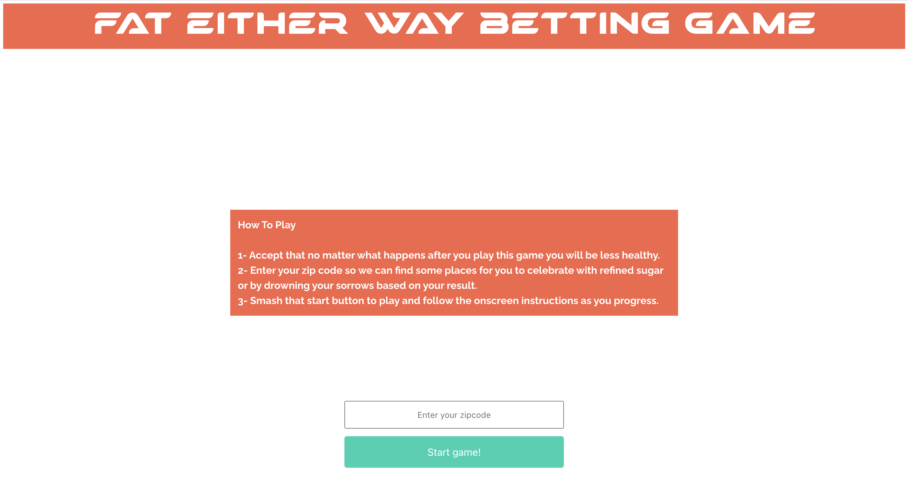
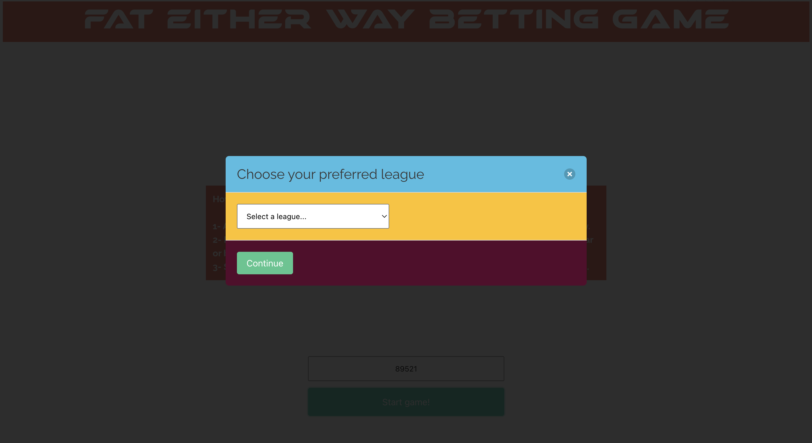
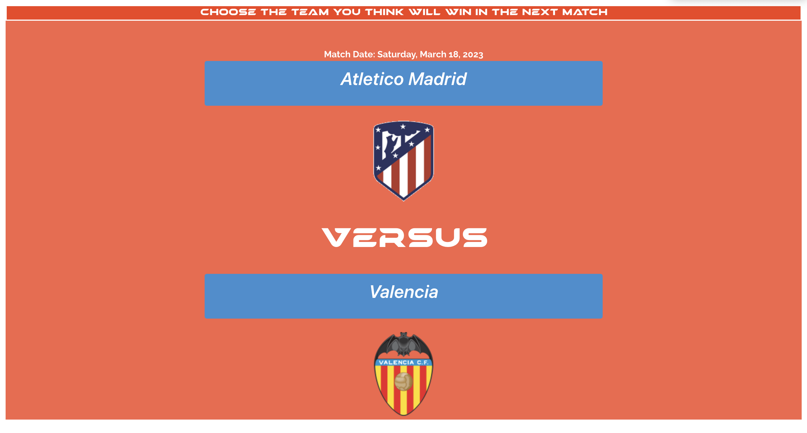
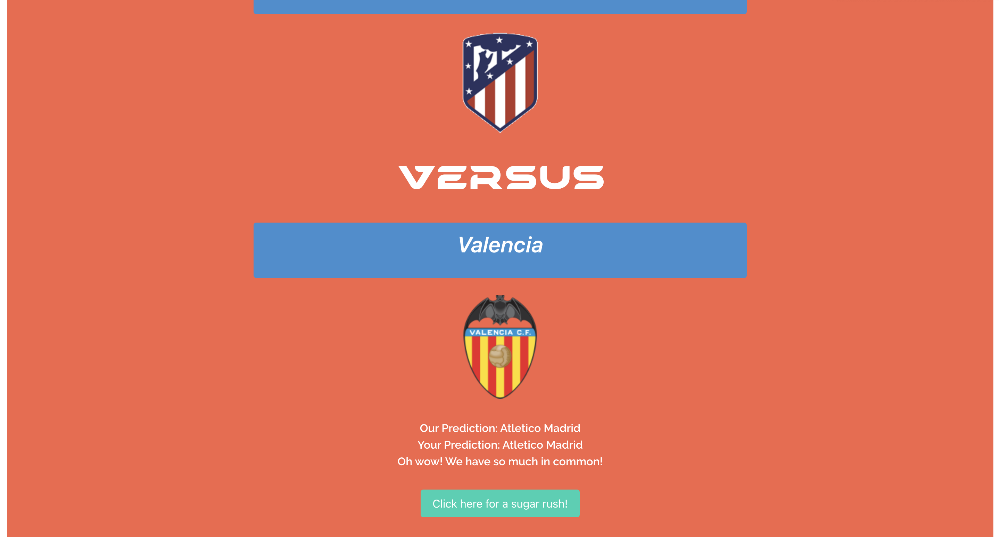
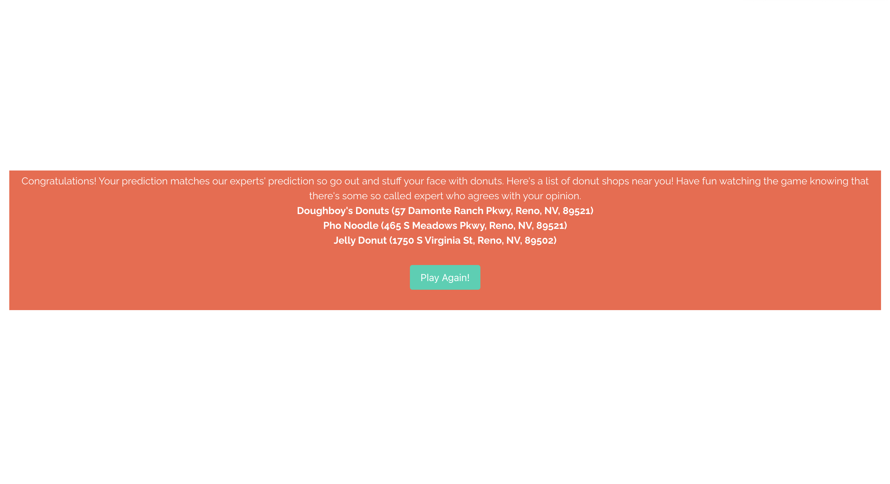
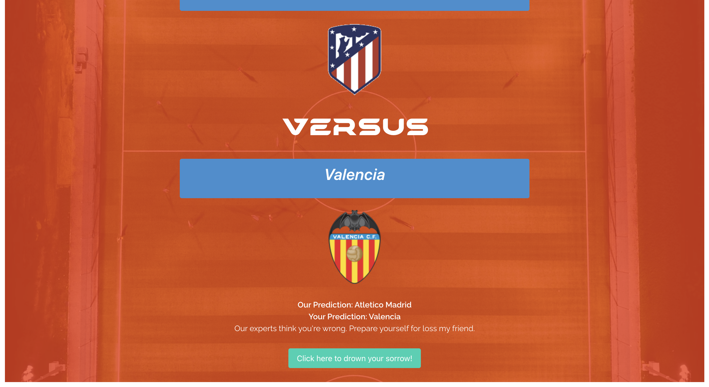
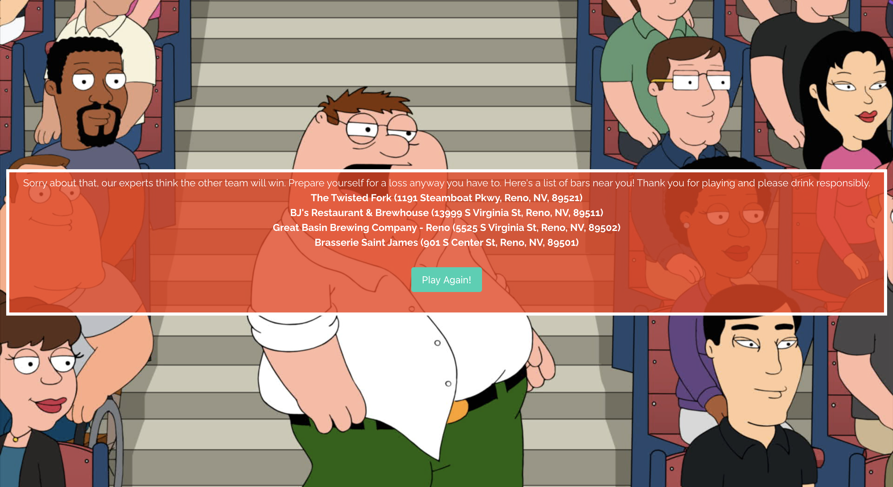

# Soccer-Betting-Mini-Game

A mini game of your prediction of the winning team vs other people's prediction for upcoming major soccer matches.

## Pseudo Code for JavaScript

```javascript
//four major leagues to focus on
//user's choice, drop down list probably
//england premier league ID 39, season 2022
//uefa champions league ID 2, season 2022
//spain la liga league ID 140, season 2022
//bundesliga league ID 78, season 2022
//getting predictions required fixture ID (interger)
//getting fixture required league ID (interger) and season (interger YYYY)
/* fetching fixture id = fetch("https://v3.football.api-sports.io/fixtures?live=all&status=NS&league={LEAGUE-ID}&season={YYYY}", {
    "method": "GET",
    "headers": {
        "x-rapidapi-host": "v3.football.api-sports.io",
        "x-rapidapi-key": "XxXxXxXxXxXxXxXxXxXxXxXx"
    }
}); */
//extracting fixture id = response.fixture.id
/* fetching prediction using fixture id = fetch("https://v3.football.api-sports.io/predictions?fixture=198772", {
    "method": "GET",
    "headers": {
        "x-rapidapi-host": "v3.football.api-sports.io",
        "x-rapidapi-key": "XxXxXxXxXxXxXxXxXxXxXxXx"
    }
}) */
//extracting prediction infos:
//response.predictions.winner.name = winning team name
//response.predictions.winner.id = id of winning team, to get icons/flags
```

## Application Description

A front-end web application that allows users to predict the winning team of upcoming major soccer matches. The application will display the upcoming matches for the user to choose from. The user will then be able to select the team and submit their prediction. The application will then display the user's prediction and the prediction of other users. The application will also display the actual winning team of the match.


URL to deployed application:
https://NganPham89.github.io/Soccer-Betting-Mini-Game/

Browsers - Chrome, Mozilla Firefox
Operating Systems - Windows and Mac
Version Control Systems - Git and Github
Coding Platform - Microsoft Visual Studio Code
Programming languages - HTML, CSS, JavaScript, jQuery, and Bulma

Below are images of the user interface of the application as displayed to the user:









URL to GitHub repository:
https://github.com/NganPham89/Soccer-Betting-Mini-Game

Contributors:
Ngan Pham: https://github.com/NganPham89
Everitt Gill: https://github.com/EverittGill
Georgina Xavier: https://github.com/Georgina5-2
Kevin Rodriguez Silveira: https://github.com/krsilveira
Kaitlyn Atif: https://github.com/kaitlynatif

Credits:
-https://www.api-football.com/
-https://www.microsoft.com/en-us/bing/apis/bing-web-search-api

## License

MIT License

Copyright (c) [2023] [Ngan Pham, Everitt Gill, Georgina Xavier, Kevin Rodriguez Silveira, Kaitlyn Atif]

Permission is hereby granted, free of charge, to any person obtaining a copy of this software and associated documentation files (the "Software"), to deal in the Software without restriction, including without limitation the rights to use, copy, modify, merge, publish, distribute, sublicense, and/or sell copies of the Software, and to permit persons to whom the Software is furnished to do so, subject to the following conditions:

The above copyright notice and this permission notice shall be included in all copies or substantial portions of the Software.

THE SOFTWARE IS PROVIDED "AS IS", WITHOUT WARRANTY OF ANY KIND, EXPRESS OR IMPLIED, INCLUDING BUT NOT LIMITED TO THE WARRANTIES OF MERCHANTABILITY, FITNESS FOR A PARTICULAR PURPOSE AND NONINFRINGEMENT. IN NO EVENT SHALL THE AUTHORS OR COPYRIGHT HOLDERS BE LIABLE FOR ANY CLAIM, DAMAGES OR OTHER LIABILITY, WHETHER IN AN ACTION OF CONTRACT, TORT OR OTHERWISE, ARISING FROM, OUT OF OR IN CONNECTION WITH THE SOFTWARE OR THE USE OR OTHER DEALINGS IN THE SOFTWARE.
